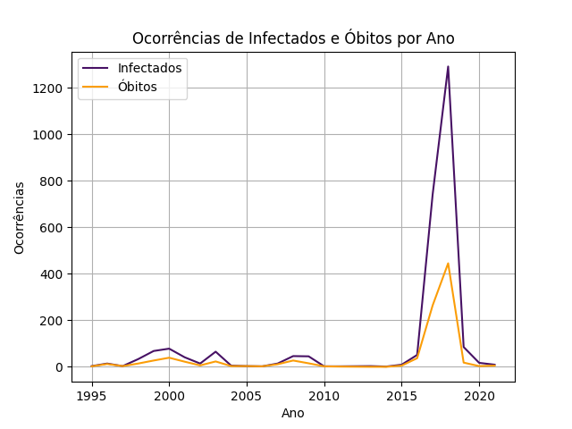
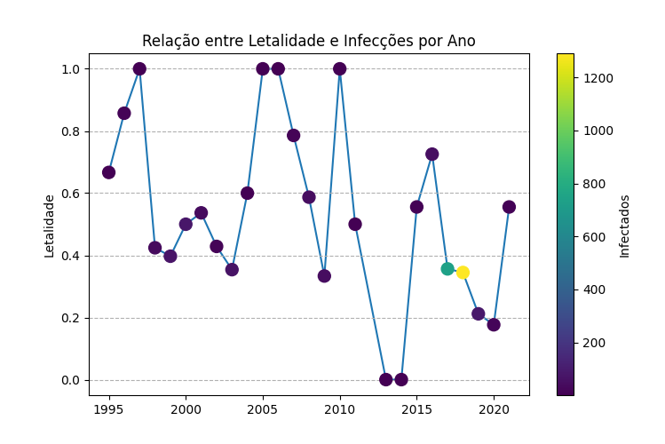

# Repositório da Avaliação A1 - Linguagens de Programação

## Descrição

Bem-vindo ao nosso repositório da Avaliação A1 da disciplina de Linguagens de Programação! Este repositório contém o código-fonte e análise de dados relacionados à ocorrência de febre amarela no Brasil. Nossa equipe é composta por Anne, Beatriz e Murilo.
## Objetivo

O objetivo principal deste projeto é analisar os dados relacionados à febre amarela no Brasil, fornecendo insights valiosos sobre sua incidência, distribuição geográfica e tendências ao longo do tempo. Nosso projeto envolve a coleta, limpeza e visualização de dados para uma melhor compreensão da situação da febre amarela no país.

## Conteúdo

O repositório contém os seguintes elementos:

1. **Códigos-Fonte**: Nossos códigos-fonte estão organizados de forma clara e compreensível. Você encontrará scripts Python que abordam a coleta e processamento de dados, análise estatística e visualização. Cada membro da equipe contribuiu de maneira significativa para o desenvolvimento desses códigos.

2. **Conjunto de Dados**: Incluímos o conjunto de dados que utilizamos em nosso projeto. Os dados são provenientes de fontes confiáveis (https://dados.gov.br/dados/conjuntos-dados/febre-amarela-em-humanos-e-primatas-no-humanos---1994-a-2021, https://censo2022.ibge.gov.br/panorama/ e https://github.com/giuliano-oliveira/geodata-br-states/tree/main) e foram tratados para garantir sua qualidade e integridade.

3. **Documentação**: Sphinx

4. **Resultados e Visualizações**: Apresentamos visualizações gráficas atraentes e resultados de análises de dados para fornecer uma visão completa da febre amarela no Brasil.

## Equipe

- **Anne Beatriz Cardoso de Sousa**: Responsável pela filtragem e análise da 
- **Beatriz Miranda Bezerra**: Encarregada da análise da distribuição por unidade federativa de infecções e óbitos.
- **Gustavo Murilo Cavalcante Carvalho**: Encarregado da análise da distribuição mensal, anual e variação da letalidade ao longo dos anos.
  
## Resultados e visualização

1. 

2.

3.

4.

5.

6.

7.

