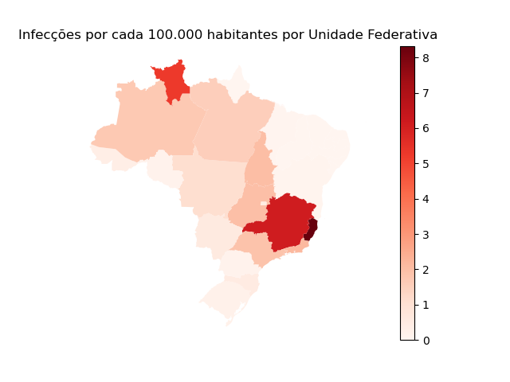
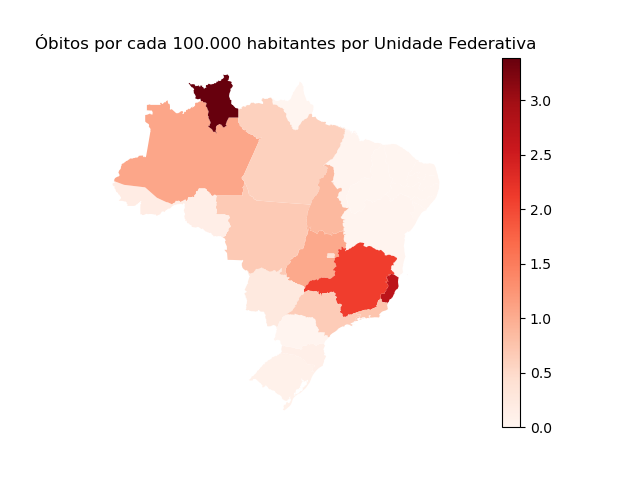

# Repositório da Avaliação A1 - Linguagens de Programação

## Descrição

Bem-vindo ao nosso repositório da Avaliação A1 da disciplina de Linguagens de Programação! Este repositório contém o código-fonte e análise de dados relacionados à ocorrência de febre amarela no Brasil. Nossa equipe é composta por Anne, Beatriz e Murilo.
## Objetivo

O objetivo principal deste projeto é analisar os dados relacionados à febre amarela no Brasil. Nosso projeto envolve a coleta, limpeza e visualização de dados para uma melhor compreensão da situação da febre amarela no país.

## Documentação
A documentaão pode ser acessada pelo link abaixo:
- [Documentação](/docs/build/html/index.html)

## Conteúdo

O repositório contém os seguintes elementos:

1. **Códigos-Fonte**: Nossos códigos-fonte estão organizados de forma clara e compreensível. Você encontrará scripts Python que abordam a coleta e processamento de dados, análise estatística e visualização. Cada membro da equipe contribuiu de maneira significativa para o desenvolvimento desses códigos.

2. **Conjunto de Dados**: Incluímos o conjunto de dados que utilizamos em nosso projeto. Os dados são provenientes de fontes confiáveis (https://dados.gov.br/dados/conjuntos-dados/febre-amarela-em-humanos-e-primatas-no-humanos---1994-a-2021, https://censo2022.ibge.gov.br/panorama/ e https://github.com/giuliano-oliveira/geodata-br-states/tree/main) e foram tratados para garantir sua qualidade e integridade.

3. **Documentação**: Sphinx

4. **Resultados e Visualizações**: Apresentamos visualizações gráficas e resultados de análises de dados.

## Equipe

- **Anne Beatriz Cardoso de Sousa**: Responsável pela filtragem e análise das ocorrências de mortes totais, por gênero e idade dos pacientes.
- **Beatriz Miranda Bezerra**: Encarregada da análise da distribuição por unidade federativa de infecções e óbitos.
- **Gustavo Murilo Cavalcante Carvalho**: Encarregado da análise da distribuição mensal, anual e variação da letalidade ao longo dos anos.
  
## Resultados e visualização

1. Neste gráfico é possível observar a maior ocorrência de febre amarela nos estados que compõem a região sudeste. Porém, uma das causas relacionadas a isso pode ser a quantidade populacional que é maior nesses estados.

2. Para os óbitos registrados, o cenário é semelhante ao gráfico anterior.

3. Entretanto, quando analisamos de forma relativa, levando em consideração os dados populacionais de cada Estado de acordo com o censo do IBGE de 2010, observamos um maior destaque de incidência para o Espírito Santo. Além disso, observamos Roraima ficando em maior evidência do que nas análises anteriores. 

4. Em relação aos óbitos a cada cem mil habitantes do respectivo estado, percebemos as regiões Norte e Centro-Oeste ganhando um pouco mais de destaque, enquanto Roraima se destaca ainda mais.

5. Nesta plotagem vemos que a doença esteve sobre controle na maior parte do tempo, mas não completamente, pois na metade da última década houve um pico de infecções e mortes, correspondente à epidemia de febre amarela que ocorreu entre 2017 e 2019.

6. O clima quente é favorável à reprodução dos mosquitos, os vetores da doença. Assim, a relação presente no gráfico faz muito sentido, pois os meses com maior número de infeções, fazem parte do verão, o período mais quente do ano. 

7. A variação da letalidade da doença ao longo dos anos não possui nenhuma tendência. Ainda assim, podemos ver que os anos com muitas infeções (2017 e 2018), nos quais há uma amostra significativa, os pontos estão na mesma faixa. Tomando esses pontos como norma, temos que a letalidade da febre amarela é de cerca de 35%.

